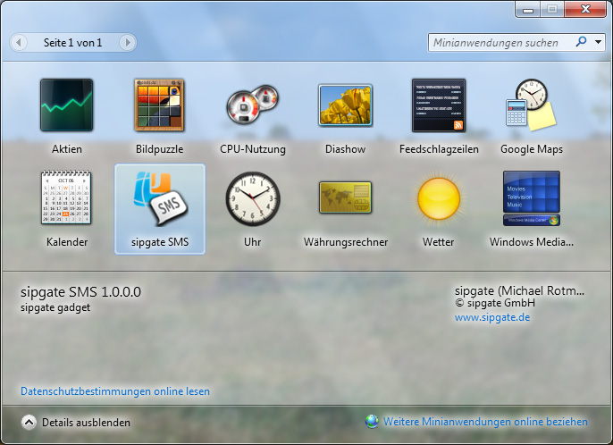
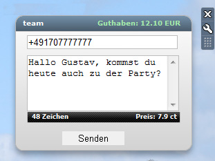

sipgate Gadget 1.0.0.0
========

*This is a Windows port for Blackmac's MacOS widget [SMSBrick][1].*

This Windows gadget enables you to send sipgate text messages (SMS) right from your Desktop using your sipgate phone book.

Actually it's a proof-of-concept. It means, that there is no error handling and localization.

**Please note: sipgate GmbH nor sipgate Inc. is responsible for this code. All trademarks are reserved.**

Screenshots
-----------

--------

Version History
---------------

_1.0.0.0_

* initial public release

License
-------

Copyright (c) 2009, Michael Rotmanov
All rights reserved.

This software is released under GNU General Public License, version 2. 
Please ensure you have [a copy of GPLv2][2].
Some parts of this software may be licensed under other agreements. Please take a note of this.

  [1]: http://github.com/BlackMac/SMSBrick "SMSBrick"
  [2]: http://www.gnu.org/licenses/gpl-2.0.html "a copy of GPLv2"